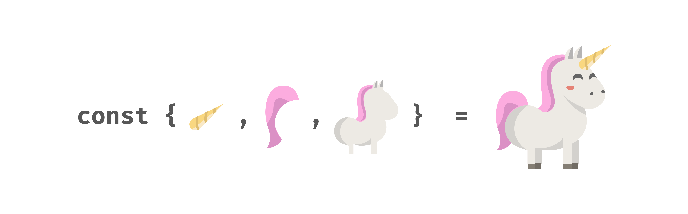
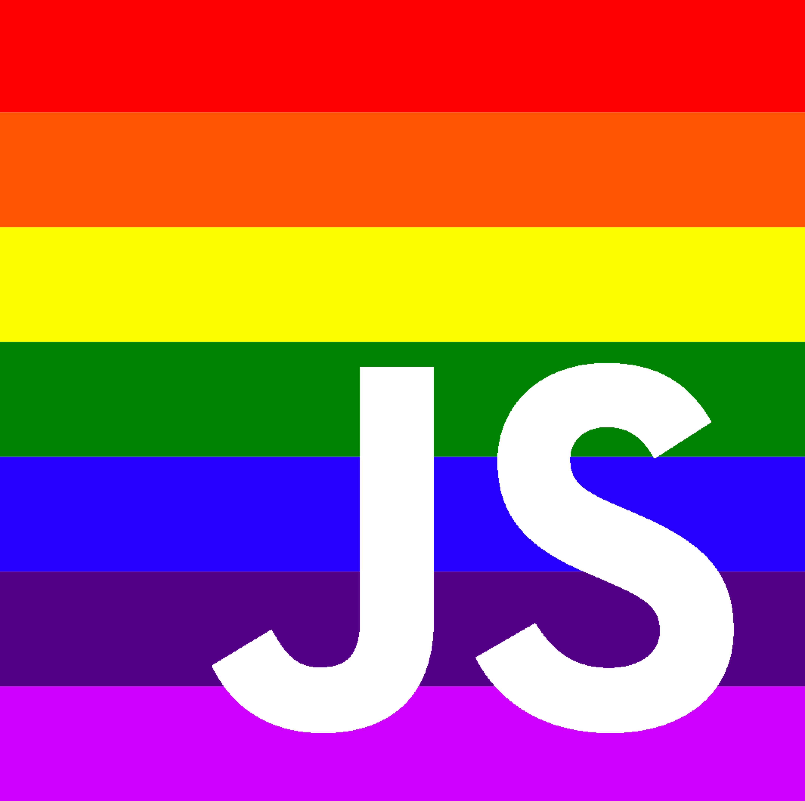
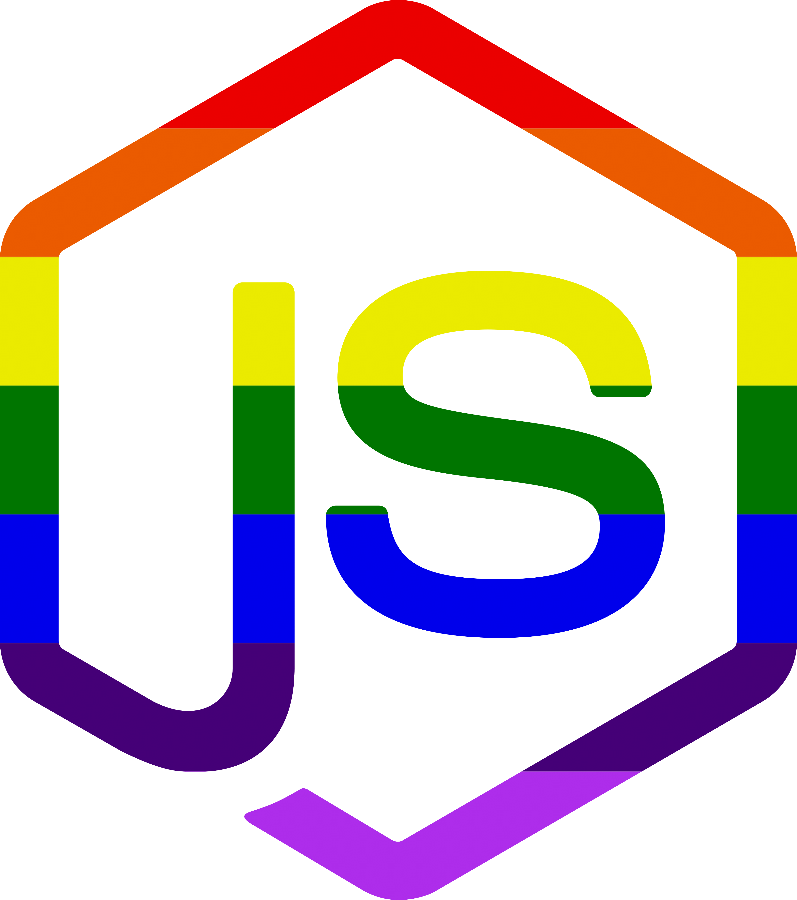
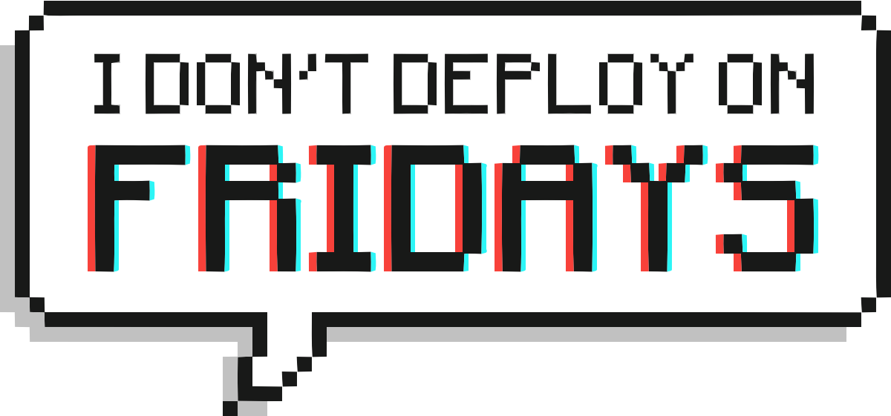

# GW Open Source Stickers

This project is a place to collaborate and design and share stickers.

Please include sketch, png, and svg files.  All the stickers are available for anyone to use.

 - If you have sticker ideas then please create an issue and we hope someone in our community will try to make it
 - If you have sticker designs then please create an issue and our team will review your design and include it in our site if the sticker does not violate our code of conduct.

**We acknowledge that github may be new to many artists.  One of the goals of this project is to encourage artists and people that don't consider themsleves to be technical experts to connect and learn how to collaborate and share.  Do not hesitate to reach out to the [GW OSPO](ospo@gwu.edu) with any questions.**

## Current Stickers

### Created by SaraVieira

(The logo of berlin js belongs to berlinjs)

## Attribution

We forked this project from SaraVieira.  Thank you SaraVieira for creating a great project with excellent stickers.  We plan to be good open source citizens and we will create pull requests for all new stickers that are created from our project that SaraVieira is welcome to include in her [repository](https://github.com/SaraVieira/open-source-stickers).

## FAQ

### Can I print this or edit them?

Sure!!

### I don't have sketch, how can I edit them?

SaraVieira says; "You can open sketch files in Figma, a free online tool
https://www.figma.com"

### Do I have to credit you?

SaraVieira says; "No! Use them, just don't be a dick and say you made them. You can credit me at this GH [SaraVieira](https://github.com/SaraVieira) or ar @NikkitaFTW at twitter."  For new stickers made by other designers, we will do our best to make it clear who the designers are so you can give them credit, but it is not required.

### Can my company print them?

SaraVieira says; "Sure! Unless you wanna use them for marketing and trademark them with your company."  The [CC-BY-NC License](https://creativecommons.org/licenses/by-nc/4.0/) for all stickers is non-commercial and you can check the link for more details.

### Do you recommend a printer service?

SaraVieira says; "I usually use https://camaloon.com/. They good, not evil and cheap so 10/10."

 This work is licensed under a <a rel="license" href="http://creativecommons.org/licenses/by-nc/4.0/">Creative Commons Attribution-NonCommercial 4.0 International License</a>.
