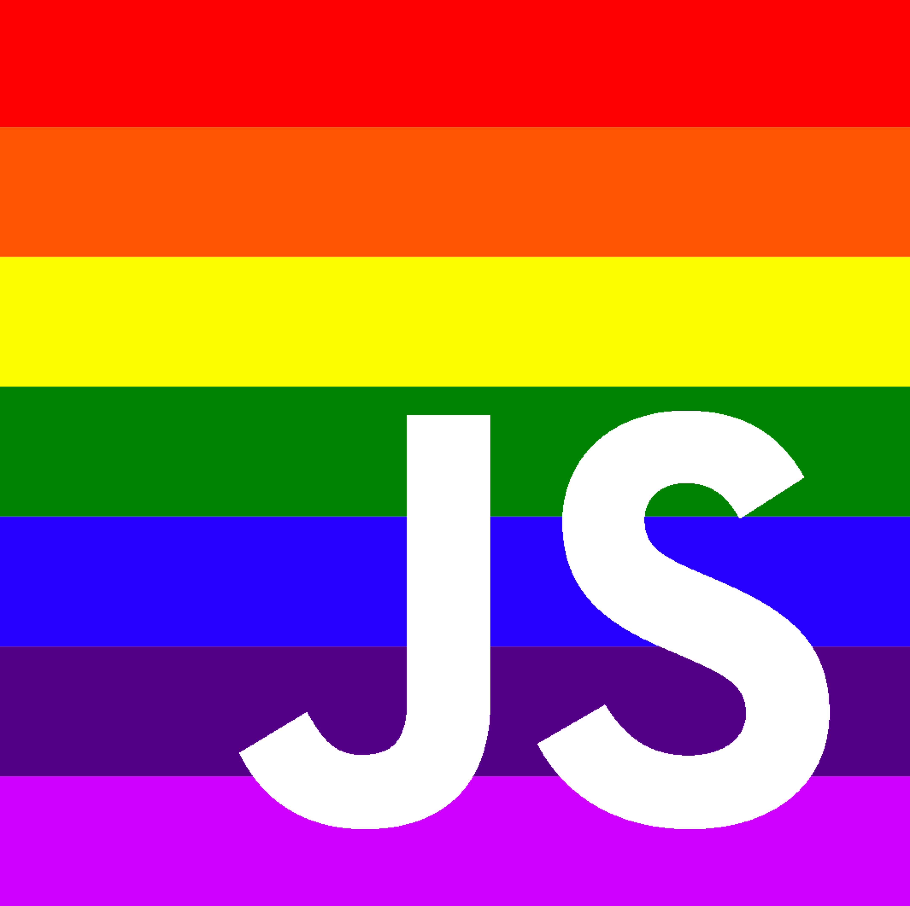
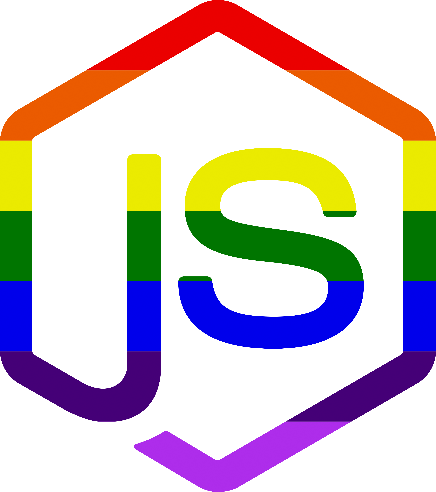

# Open Source Stickers

Here are all stickers I made that anyone can use.

I include sketch, png and svg files.
Some are missing because I delete files :(

**If you have sticker ideas feel free to create an issue and I will try to make it**

## Current Stickers

(The logo of berlin js belongs to berlinjs)

## FAQ

### Can I print this or edit them?

Sure!!

### I don't have sketch, how can I edit them?

You can open sketch files in Figma, a free online tool
https://www.figma.com

### Do I have to credit you?

No! Use them, just don't be a dick and say you made them. You can credit me at this GH or ar @NikkitaFTW at twitter.

### Can my company print them?

Sure! Unless you wanna use them for marketing and trademark them with your company.

### Do you recommend a printer service?

I usually use https://camaloon.com/. They good, not evil and cheap so 10/10.

### Your sketch files look like shit

😭

 This work is licensed under a <a rel="license" href="http://creativecommons.org/licenses/by-nc/4.0/">Creative Commons Attribution-NonCommercial 4.0 International License</a>.
