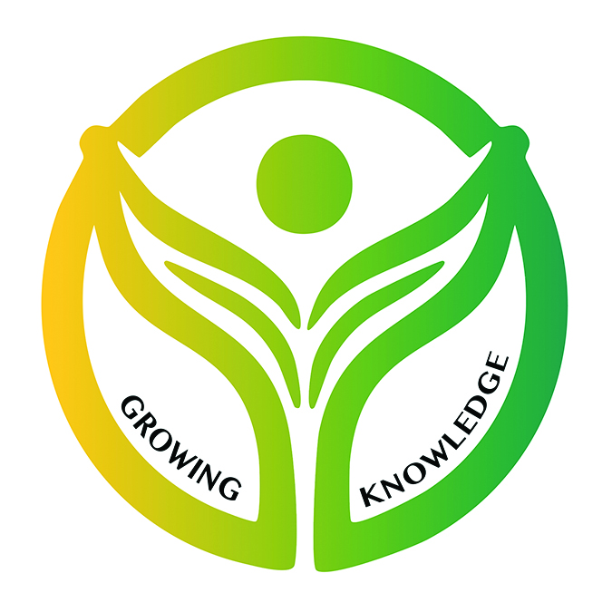
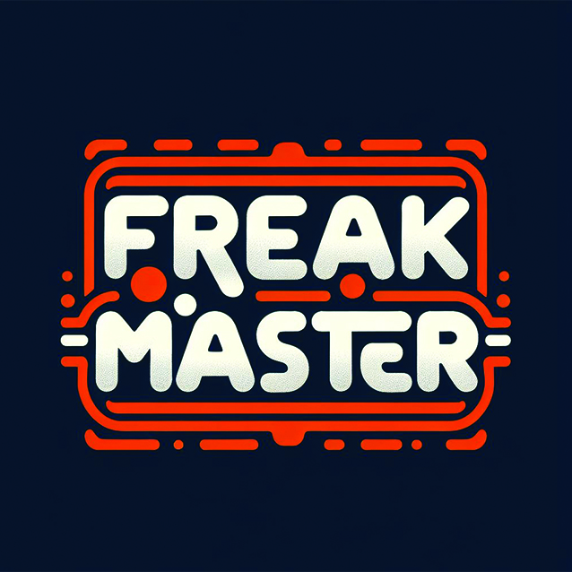
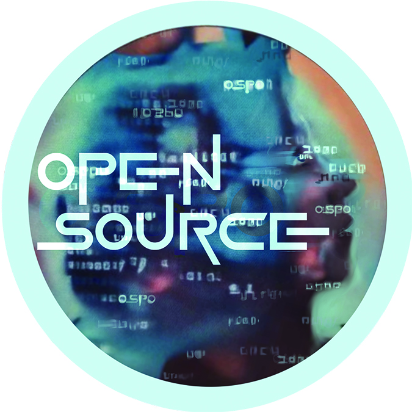

# GW Open Source Stickers

Thus far we have two sets of stickers designed by the GW community.  We are excited to debut several stickers created by students in a digital art class in coordination with the GW OSPO.  Please give attribution to these great artists if you use any of their designs.

**We acknowledge that github may be new to many artists.  One of the goals of this project is to encourage artists and people that don't consider themsleves to be technical experts to connect and learn how to collaborate and share.  Do not hesitate to reach out to the [GW OSPO](ospo@gwu.edu) with any questions.**

## Current Stickers

### 2025 GW OSCON logo created by the GW Marketing & Communication Team

GW OSCON Logo

### 2025 GW OSCON stickers created by GW students as a part of their digital arts course in collaboration with the GW OSPO

Growing Knowledge sticker made by @ Anna Grettano

Freak Master sticker made by @ Ben Chyba

Open Source sticker made by @ Elise Biondi

OSPO sticker made by @ Kaia Jordan

Free Puppy sticker made by @ Lillie Loftis

Code Unicorn sticker made by @ Midori Bonner

2025 GW OSCON sticker made by @ Mikayle Huntington

[git-forked sticker made by @ Nina Hrivnak

Source Freedom Pomegranate sticker made by @ Sam Bellon

Public Sauce sticker made by @ James Huckenpahler (faculty)

## Attribution

We forked this project from SaraVieira.  Thank you SaraVieira for creating a great project with excellent stickers.  We plan to be good open source citizens and we will create pull requests for all new stickers that are created from our project that SaraVieira is welcome to include in her [repository](https://github.com/SaraVieira/open-source-stickers).

## License

- **CC-BY License**: The content in the `gw-stickers` folder is licensed under the [Creative Commons Attribution 4.0 International License](https://creativecommons.org/licenses/by/4.0/).

 This work is licensed under a <a rel="license" href="http://creativecommons.org/licenses/by/4.0/">Creative Commons Attribution 4.0 International License</a>.
